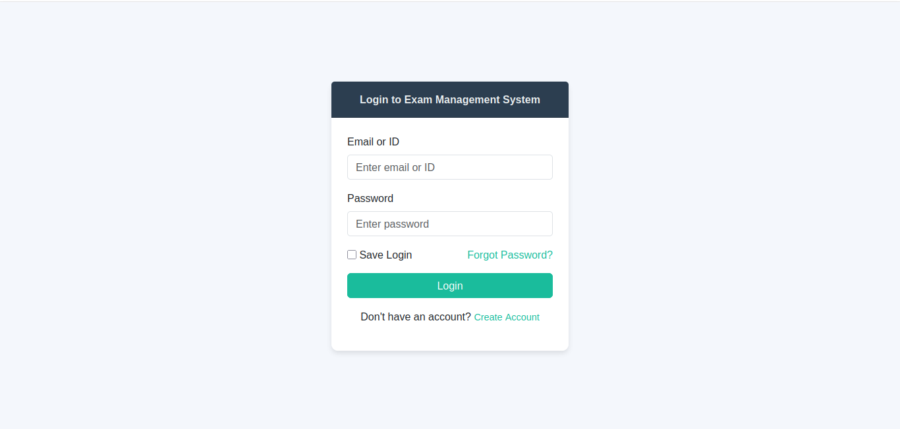
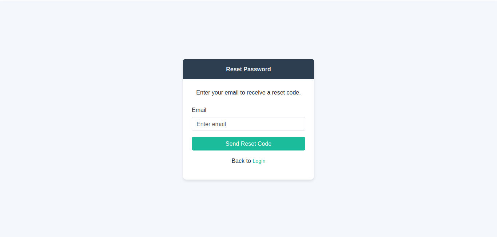
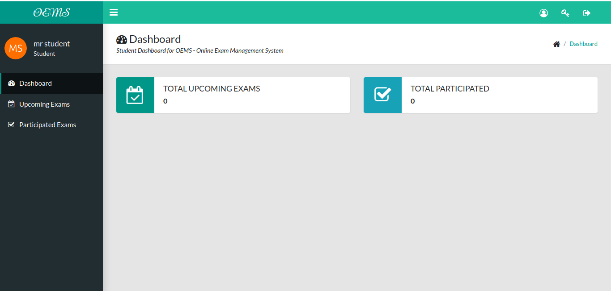
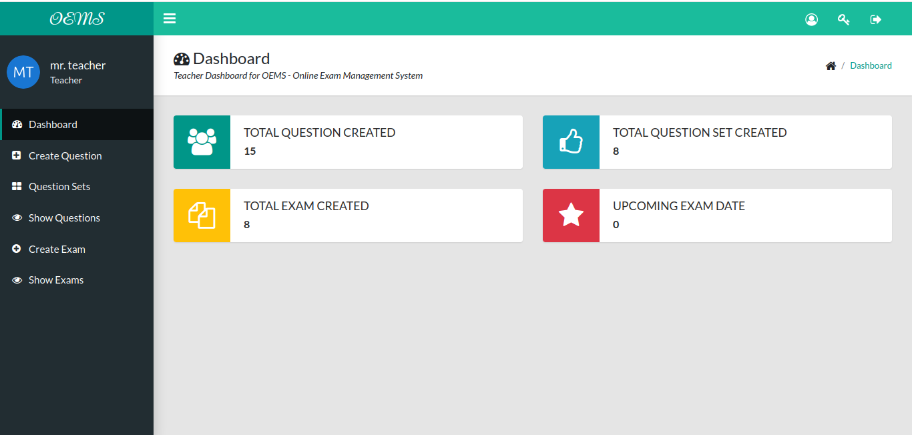
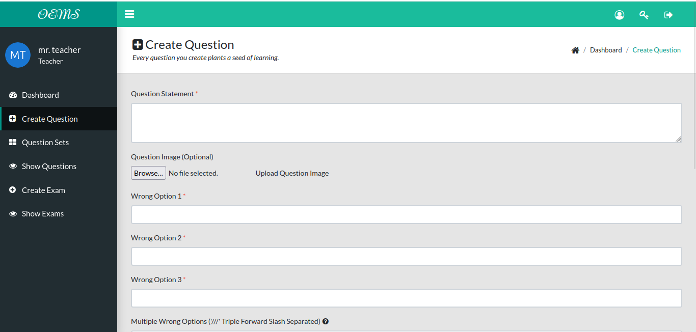
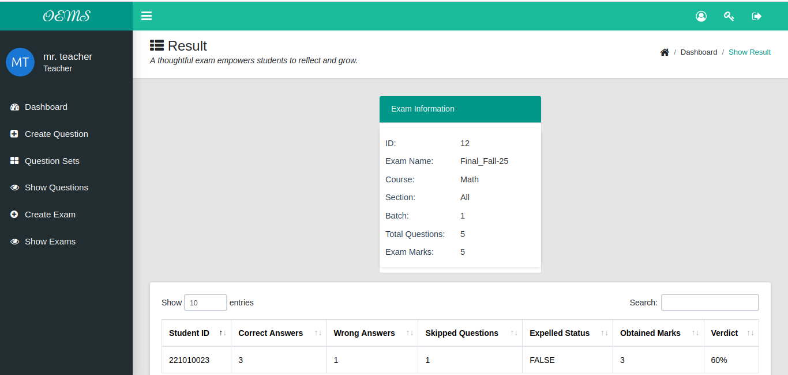

# Quiz Management System V1.2

  


A web application online exam management system built with **Java (Servlets & JSP)**, featuring role-based access, question management, and automated evaluation. Designed for educational institutions and training platforms.

---

## 🚀 Features
- User authentication and role-based access (Admin, Teacher, Student).  
- Exam, Question set, Quiz question creation, update, and deletion.  
- Question bank management.  
- Automated result calculation and reporting.  
- Email verification using **Jakarta Mail**.  
- Database integration via **ODBC11**.  
- Responsive UI with JSP, CSS, Bootstrap and JavaScript.

---

```
count of source line code in "/QuizeManagement_v1.2/src"
-------------------------------------------------------------------------------
Language                     files          blank        comment           code
-------------------------------------------------------------------------------
CSS                              1           1824            235          13176
JSP                             34           1020            120           5341
Java                            59            754            675           4734
XML                              1              2              0            339
JavaScript                       4              6             14            183
-------------------------------------------------------------------------------
SUM:                            99           3606           1044          23773
-------------------------------------------------------------------------------

```


```markdown
## 📂 Project Structure
├── README.md
├── screenshots
│   ├── login.png
│   ├── question_cr1.png
│   ├── question_cr2.png
│   ├── reset_pass.png
│   ├── show_res.png
│   ├── student_d.png
│   └── teacher_d.png
├── source files
│   ├── QuizeManagement_v1.2.war
│   └── quiz_management.sql
└── src
    └── main
        ├── java
        │   ├── dao
        │   │   ├── BatchSectionDao.java
        │   │   ├── CreateQuestionDao.java
        │   │   ├── ExamsDao.java
        │   │   ├── OptionsDao.java
        │   │   ├── QuestionsDao.java
        │   │   ├── QuestionSetsDao.java
        │   │   ├── UsersDao.java
        │   │   └── VerifyPinsDao.java
        │   ├── entities
        │   │   ├── BatchClass.java
        │   │   ├── Course.java
        │   │   ├── ExamsEvaluation.java
        │   │   ├── Exams.java
        │   │   ├── Options.java
        │   │   ├── QuestionSets.java
        │   │   ├── Questions.java
        │   │   ├── Sections.java
        │   │   ├── Users.java
        │   │   └── VerifyPin.java
        │   ├── filters
        │   │   ├── AdminFilter.java
        │   │   ├── CurrentUserFilter.java
        │   │   ├── StudentFilter.java
        │   │   └── TeacherFilter.java
        │   ├── helper
        │   │   ├── ConnectionProvider.java
        │   │   ├── GEmailSender.java
        │   │   ├── GeneratePinCode.java
        │   │   ├── GetBatchSectionOfStudentPOJO.java
        │   │   ├── QuestionCommonSession.java
        │   │   ├── QuestionToAnswerePOJO.java
        │   │   ├── Quotes.java
        │   │   ├── ShowQuestionFilterPOJO.java
        │   │   └── TempExamCreateSessionPOJO.java
        │   ├── secret
        │   │   ├── EMAIL_KEY.java
        │   │   └── VERIFY_CODE.java
        │   └── servlets
        │       ├── AddToQuestionSetServlet.java
        │       ├── ApprovedAllStudent.java
        │       ├── ApprovedExamServlet.java
        │       ├── ApprovedUserServlet.java
        │       ├── ChangePasswordServlet.java
        │       ├── CreateExamServlet.java
        │       ├── CreateQuestionServlet.java
        │       ├── CreateQuestionSetServlet.java
        │       ├── DeclineUserServlet.java
        │       ├── DeleteExamServlet.java
        │       ├── DeleteQuestionServlet.java
        │       ├── DeleteQuestionSetServlet.java
        │       ├── EditExamServlet.java
        │       ├── EvaluateExamServlet.java
        │       ├── ForgotePasswordCheckCodeServlet.java
        │       ├── ForgotePasswordSentCodeServlet.java
        │       ├── LoginServlet.java
        │       ├── LogoutServlet.java
        │       ├── MakeAdminServlet.java
        │       ├── RegisterServlet.java
        │       ├── RemoveAdminServlet.java
        │       ├── RemoveToQuestionSetServlet.java
        │       ├── ResentCodeServlet.java
        │       ├── test.java
        │       ├── UpdateQuestionServlet.java
        │       └── VerifyCodeServlet.java
        └── webapp
            ├── admin
            │   ├── bottom_common.jsp
            │   ├── dashboard.jsp
            │   ├── pending_exams.jsp
            │   ├── pending_users.jsp
            │   ├── select_students.jsp
            │   ├── show_admins.jsp
            │   ├── show_permitted_exams.jsp
            │   ├── show_students.jsp
            │   ├── show_teachers.jsp
            │   └── top_common.jsp
            ├── assets
            │   ├── jquery-3.2.1.min.js
            │   ├── main.css
            │   ├── main.js
            │   └── plugins
            │       ├── dataTables.bootstrap.min.js
            │       └── jquery.dataTables.min.js
            ├── index.jsp
            ├── login.jsp
            ├── META-INF
            │   └── MANIFEST.MF
            ├── register.jsp
            ├── reset_password.jsp
            ├── set_new_password.jsp
            ├── student
            │   ├── bottom_common.jsp
            │   ├── dashboard.jsp
            │   ├── exam_evaluation.jsp
            │   ├── exam.jsp
            │   ├── my_exams.jsp
            │   ├── participated_exams.jsp
            │   └── top_common.jsp
            ├── teacher
            │   ├── bottom_common.jsp
            │   ├── create_exam.jsp
            │   ├── create_question.jsp
            │   ├── dashboard.jsp
            │   ├── edit_exam.jsp
            │   ├── edit_question.jsp
            │   ├── select_question_set.jsp
            │   ├── show_exams.jsp
            │   ├── show_question_set.jsp
            │   ├── show_questions.jsp
            │   ├── show_results.jsp
            │   └── top_common.jsp
            ├── unauthorized.jsp
            ├── verify.jsp
            └── WEB-INF
                ├── lib
                └── web.xml


---
```
## ⚙️ Tech Stack
- **Backend:** Java Servlets, JSP  
- **Frontend:** JSP, CSS, JavaScript  
- **Database:** Oracle 21c (via ODBC11)  
- **Email Service:** Jakarta Mail  
- **Build/Deploy:** WAR file for servlet containers (e.g., Apache Tomcat)

---

## 🛠️ Setup & Installation

### Prerequisites
- Java 21 (Recomended)  
- Apache Tomcat 10.1  
- Oracle 21c (or compatible DB)  
- ODBC11 driver installed  
- Jakarta Mail library  

### Steps
1. **Clone the repository**
```bash
   git clone https://github.com/rahimuj570/quize_management_V1.2.git
   cd quize_management_V1.2
```

2. **Import Database**

   * Create a new database in Oracle 21c (e.g., `quiz_db`).
   * Run the script from `source files/quiz_management.sql`.

3. **Configure Database Connection**

   * Update DB credentials in your `helper/ConnectionProvider.java` config class.
   * Ensure ODBC11 is installed and properly mapped.

4. **Deploy WAR File**

   * Copy `source files/quize_management.war` to `tomcat/webapps/`.
   * Start Tomcat and access the app at:

     ```
     http://localhost:8080/quize_management
     ```

---

## 📖 Usage

* **Admin:** Manage users, approved exam, manage exam permision
* **Teacher:** Create and publish exams, view results, create question sets and questions.
* **Student:** Attempt exams, view scores.

---

## 📸 Screenshots

### 🔑 Login Page



### 🔑 Reset Password



### 🏠 Student Dashboard



### 🏠 Teacher Dashboard



### 📝 Quiz Creation (view 1)



### 📝 Quiz Creation (full view)


### 📝 Teacher Show Results




---

## 🔧 Development

If you want to run the project from source:

* Open the project in an IDE (IntelliJ, Eclipse, NetBeans).
* Configure Tomcat server in the IDE.
* Run the project, which will deploy `src/main/webapp` and servlets automatically or import the **.war** file.

---

## 🤝 Contribution

1. Fork the repo
2. Create a feature branch (`feature/my-new-feature`)
3. Commit changes (`git commit -m 'Add feature'`)
4. Push to branch
5. Open a Pull Request

---

